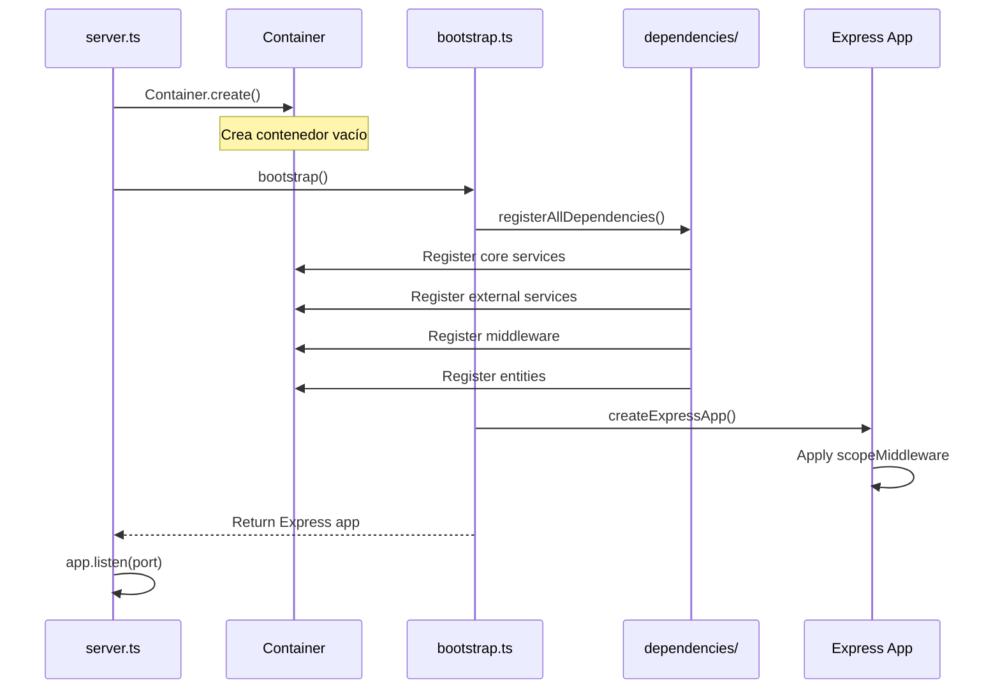

# Container & Dependency Injection - Documentación Técnica

## 📋 Tabla de Contenidos

1. [Arquitectura General](#arquitectura-general)
2. [Componentes Principales](#componentes-principales)
3. [Flujo de Inicialización](#flujo-de-inicialización)
4. [Tipos y Interfaces](#tipos-y-interfaces)
5. [Ciclos de Vida](#ciclos-de-vida)
6. [Sistema de Scopes](#sistema-de-scopes)
7. [Patrones Implementados](#patrones-implementados)
8. [Decisiones de Diseño](#decisiones-de-diseño)

## Arquitectura General

### Diagrama de Componentes

```
┌─────────────────────────────────────────────────────────┐
│                     Application                          │
├─────────────────────────────────────────────────────────┤
│                       server.ts                          │
│                    (Entry Point)                         │
│                         ↓                                │
│                   Container.create()                     │
│                         ↓                                │
│                    bootstrap.ts                          │
│                         ↓                                │
│              registerAllDependencies()                   │
│                         ↓                                │
├─────────────────────────────────────────────────────────┤
│                  Dependencies Layer                      │
│  ┌──────────────────────────────────────────────────┐   │
│  │ core/dependencies/                              │   │
│  │   ├── core.dependencies.ts → Logger, Config    │   │
│  │   ├── external.dependencies.ts → DB, Storage   │   │
│  │   └── middleware.dependencies.ts → Auth        │   │
│  │ api/dependencies/                               │   │
│  │   └── entities.dependencies.ts → Controllers   │   │
│  └──────────────────────────────────────────────────┘   │
├─────────────────────────────────────────────────────────┤
│                    Awilix Container                      │
│  ┌──────────────────────────────────────────────────┐   │
│  │  Root Container (Singleton)                      │   │
│  │    ├── Singleton Services                        │   │
│  │    └── Scoped Services Templates                 │   │
│  └──────────────────────────────────────────────────┘   │
│  ┌──────────────────────────────────────────────────┐   │
│  │  Request Scope (Per HTTP Request)                │   │
│  │    └── Scoped Service Instances                  │   │
│  └──────────────────────────────────────────────────┘   │
└─────────────────────────────────────────────────────────┘
```

## Componentes Principales

### 1. Container Class (`src/core/Container.ts`)

```typescript
export class Container {
  private static instance: AwilixContainer | null = null;
  private static initialized = false;

  static create(): AwilixContainer
  static get(): AwilixContainer
  static resolve<T>(name: string): T
  static createScope(): AwilixContainer
  static register(name: string): RegistrationBuilder
  static registerBulk(services: Record<string, Resolver<unknown>>): void
  static dispose(): void
}
```

**Responsabilidades:**
- Gestión del ciclo de vida del contenedor
- Creación de scopes para aislamiento por request
- API fluida para registro de dependencias
- Resolución de dependencias con tipos seguros

### 2. Registration System

```typescript
// Tipos base
type Constructor<T = object> = new (...args: any[]) => T;

// Builder Pattern Interfaces
interface ClassRegistration<T> {
  inject(injector: () => Record<string, unknown>): ClassRegistration<T>;
  singleton(): AwilixContainer;
  scoped(): AwilixContainer;
  transient(): AwilixContainer;
}

interface FunctionRegistration {
  singleton(): AwilixContainer;
  scoped(): AwilixContainer;
  transient(): AwilixContainer;
}

interface RegistrationBuilder {
  asClass<T>(ServiceClass: Constructor<T>): ClassRegistration<T>;
  asFunction<T>(factory: (...args: unknown[]) => T): FunctionRegistration;
  asValue<T>(value: T): AwilixContainer;
}
```

### 3. Scope Middleware (`src/core/middleware/scopeMiddleware.ts`)

```typescript
export function scopeMiddleware(req: Request, _res: Response, next: NextFunction): void {
  req.scope = Container.createScope();
  next();
}
```

**Función:** Crear un contenedor aislado por cada request HTTP.

## Flujo de Inicialización

### Secuencia de Arranque



### Orden de Registro de Dependencias

1. **Core Dependencies** (Primero)
   - Logger
   - Configuration
   - Servicios fundamentales

2. **External Dependencies**
   - Conexiones a base de datos
   - Clientes de servicios externos
   - Sistemas de caché

3. **Middleware Dependencies**
   - Autenticación
   - Validación
   - Rate limiting

4. **Entity Dependencies** (Último)
   - Repositories
   - Services
   - Controllers

Este orden garantiza que las dependencias de nivel inferior estén disponibles para las de nivel superior.

## Tipos y Interfaces

### Sistema de Tipos Genéricos

```typescript
// Constructor genérico para clases
type Constructor<T = object> = new (...args: any[]) => T;

// Uso en el builder
Container.register('userService')
  .asClass<UserService>(UserService)  // T inferido
  .scoped();
```

### Type Safety en Resolución

```typescript
// Resolución con tipos
const logger = Container.resolve<ILoggerService>('loggerService');
// TypeScript conoce que logger es ILoggerService

// En scopes
const service = req.scope.resolve<UserService>('userService');
// Type safety mantenido en scopes
```

## Ciclos de Vida

### 1. Singleton
```typescript
Container.register('logger').asClass(LoggerService).singleton();
```
- **Una instancia** para toda la aplicación
- Creada la primera vez que se resuelve
- Compartida entre todas las requests
- **Uso:** Servicios stateless, configuración, loggers

### 2. Scoped
```typescript
Container.register('transactionService').asClass(TransactionService).scoped();
```
- **Una instancia por scope** (request)
- Compartida dentro del mismo scope
- Diferente entre requests
- **Uso:** Transacciones DB, contexto de usuario, servicios con estado por request

### 3. Transient
```typescript
Container.register('emailBuilder').asClass(EmailBuilder).transient();
```
- **Nueva instancia** cada vez que se resuelve
- Nunca compartida
- **Uso:** Builders, factories, objetos de un solo uso

### Tabla Comparativa

| Lifecycle | Instancias | Compartido | Caso de Uso |
|-----------|------------|------------|-------------|
| Singleton | 1 global | Sí (global) | Logger, Config, DB Connection |
| Scoped | 1 por request | Sí (en request) | Transaction, User Context |
| Transient | N (siempre nueva) | No | Builders, Temporary Objects |

## Sistema de Scopes

### Root Container vs Request Scope

```typescript
// Root Container (aplicación)
const rootContainer = Container.get();
rootContainer.resolve('logger'); // Singleton desde root

// Request Scope (por petición HTTP)
const requestScope = Container.createScope();
requestScope.resolve('transactionService'); // Scoped, única para este request
```

### Jerarquía de Resolución

```
Root Container
    ├── Singletons (resueltos aquí)
    └── Request Scope 1
        └── Scoped Services (instancia 1)
    └── Request Scope 2
        └── Scoped Services (instancia 2, diferente)
```

### Implementación del Scope Middleware

```typescript
// Automático en cada request
app.use((req, res, next) => {
  req.scope = Container.createScope();

  // Opcional: agregar valores específicos del request
  req.scope.register({
    currentUser: asValue(req.user),
    requestId: asValue(generateId())
  });

  next();
});
```

## Patrones Implementados

### 1. Singleton Pattern
- Container mantiene una única instancia global
- Método `create()` retorna la misma instancia si ya existe

### 2. Builder Pattern
- API fluida para configuración de servicios
- Encadenamiento de métodos para configuración

### 3. Factory Pattern
- `asFunction()` permite registrar factories
- `createScope()` actúa como factory de scopes

### 4. Dependency Injection Pattern
- Constructor injection (CLASSIC mode)
- Inversión de control completa

### 5. Service Locator Pattern
- `Container.resolve()` actúa como localizador
- Anti-patrón parcialmente mitigado con scopes

## Decisiones de Diseño

### 1. ¿Por qué CLASSIC mode?

```typescript
injectionMode: InjectionMode.CLASSIC
```

**Ventajas:**
- Explícito y predecible
- Compatible con TypeScript sin decoradores
- Mejor debugging

**Trade-offs:**
- Más verbose que PROXY mode
- Requiere listar dependencias en constructor

### 2. ¿Por qué tipos genéricos mejorados?

```typescript
type Constructor<T = object> = new (...args: any[]) => T;
```

**Beneficios:**
- Type safety en tiempo de compilación
- Mejor IntelliSense en IDEs
- Menos errores en runtime

### 3. ¿Por qué scopes por request?

**Problema resuelto:**
- Aislamiento de estado entre requests concurrentes
- Transacciones de BD compartidas en una request
- Contexto de usuario aislado

### 4. ¿Por qué archivos de dependencias separados?

```
core/dependencies/
  ├── index.ts                    # Orquestador
  ├── core.dependencies.ts        # Sistema core
  ├── external.dependencies.ts    # Servicios externos
  └── middleware.dependencies.ts  # Middleware

api/dependencies/
  └── entities.dependencies.ts    # Entidades del dominio
```

**Ventajas:**
- Organización clara por dominio
- Fácil activar/desactivar features
- Evita archivo monolítico
- Mejor para equipos grandes

### 5. ¿Por qué no usar decoradores?

**Decisión:** No usar decoradores de TypeScript

**Razones:**
- Requieren configuración adicional
- Experimental en TypeScript
- Mayor complejidad
- El enfoque actual es más explícito

## Consideraciones de Rendimiento

### Memory Management

```typescript
// Scopes se limpian automáticamente por GC
// Pero podemos forzar limpieza si necesario
app.use((req, res, next) => {
  res.on('finish', () => {
    req.scope?.dispose?.();
  });
  next();
});
```

### Lazy Loading

```typescript
// Services solo se instancian cuando se necesitan
Container.register('heavyService')
  .asClass(HeavyService)
  .singleton(); // No se crea hasta primer resolve()
```

### Caching de Resolución

- **Singleton:** Caché permanente
- **Scoped:** Caché por duración del scope
- **Transient:** Sin caché

## Testing

### Configuración para Tests

```typescript
// src/core/dependencies/index.ts
export function registerTestDependencies(container: AwilixContainer): void {
  registerCoreDependencies(container);

  // Override con mocks
  Container.register('emailService').asValue(mockEmailService);
  Container.register('dbConnection').asValue(mockDatabase);
}
```

### Limpieza entre Tests

```typescript
afterEach(() => {
  Container.dispose();
});

beforeEach(() => {
  Container.create();
  registerTestDependencies(Container.get());
});
```

## Troubleshooting

### Errores Comunes

1. **"Container not initialized"**
   - Causa: Llamar `Container.get()` antes de `Container.create()`
   - Solución: Asegurar que `server.ts` llama `create()` primero

2. **"Cannot resolve 'serviceName'"**
   - Causa: Servicio no registrado
   - Solución: Verificar registro en `dependencies/*.ts`

3. **"Scope middleware not configured"**
   - Causa: Intentar usar `req.scope` sin middleware
   - Solución: Verificar que `scopeMiddleware` está aplicado

### Debug de Dependencias

```typescript
// Ver todas las dependencias registradas
console.log(Container.get().registrations);

// Verificar si existe una dependencia
Container.get().has('serviceName');

// Ver el grafo de dependencias
Container.get().resolve('serviceName');
// Inspeccionar con debugger las dependencias inyectadas
```

## Referencias

- [Awilix Documentation](https://github.com/jeffijoe/awilix)
- [Dependency Injection Pattern](https://martinfowler.com/articles/injection.html)
- [TypeScript Handbook - Decorators](https://www.typescriptlang.org/docs/handbook/decorators.html)