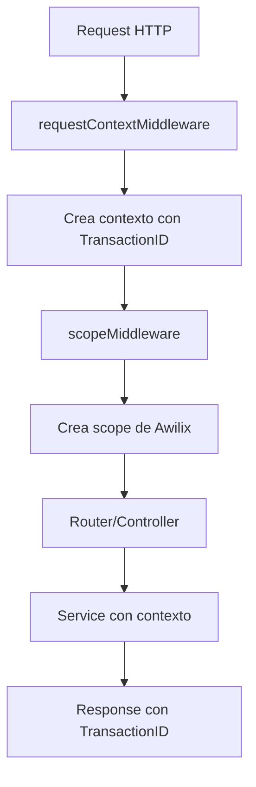

# Guía de Integración del Sistema RequestContext

## 📋 Tabla de Contenidos
- [Introducción](#introducción)
- [¿Qué hemos integrado?](#qué-hemos-integrado)
- [Arquitectura actual](#arquitectura-actual)
- [¿Qué es RequestContext?](#qué-es-requestcontext)
- [¿Qué es Awilix?](#qué-es-awilix)
- [Cómo trabajan juntos](#cómo-trabajan-juntos)
- [Uso del RequestContext](#uso-del-requestcontext)
- [Ejemplos prácticos](#ejemplos-prácticos)
- [Mejorando el código existente](#mejorando-el-código-existente)
- [FAQ](#faq)

## Introducción

Esta guía documenta la integración del sistema de contexto de solicitud (RequestContext) en la aplicación, que ahora coexiste con el sistema de inyección de dependencias Awilix existente.

## ¿Qué hemos integrado?

### Cambios realizados

1. **Agregado `requestContextMiddleware`** al Express app
2. **Importados los hooks de contexto**: `useTransactionId`, `useCurrentUser`, `addTransactionData`
3. **Actualizado el middleware de errores** para usar información del contexto
4. **Configurado el tracking de transacciones** con IDs únicos por request

### Archivos modificados

```
src/
├── core/
│   ├── createExpressApp.ts (modificado)
│   └── middleware/
│       └── requestContextMiddleware.ts (agregado)
```

## Arquitectura actual

La aplicación ahora tiene DOS sistemas complementarios trabajando juntos:

### 1. Sistema de Inyección de Dependencias (Awilix)
- **Propósito**: Crear y gestionar instancias de servicios
- **Middleware**: `scopeMiddleware`
- **Acceso**: `req.scope.resolve('serviceName')`

### 2. Sistema de Contexto de Solicitud (RequestContext)
- **Propósito**: Mantener información contextual de la request
- **Middleware**: `requestContextMiddleware`
- **Acceso**: Hooks como `useTransactionId(req)`

## ¿Qué es RequestContext?

El RequestContext es un sistema que mantiene información sobre la solicitud HTTP actual a lo largo de todo su ciclo de vida.

### Características principales:

- **Transaction ID único**: Cada request tiene un ID único para tracking
- **Información del usuario**: Mantiene datos del usuario autenticado
- **Metadata de la request**: IP, user-agent, método, path
- **Datos de transacción**: Información acumulable durante el procesamiento
- **Timestamps y duración**: Medición del tiempo de procesamiento

### Hooks disponibles:

```typescript
// Obtener el ID de transacción
useTransactionId(req: Request): string

// Obtener información del usuario actual
useCurrentUser(req: Request): { _id: string, role: string } | undefined

// Agregar datos al contexto de la transacción
addTransactionData(req: Request, key: string, value: unknown): void

// Establecer información del usuario
setUser(req: Request, userId: string, role: string, additionalData?: Record<string, unknown>): void
```

## ¿Qué es Awilix?

Awilix es un contenedor de inyección de dependencias que:

- **Crea instancias** de servicios, repositorios y controllers automáticamente
- **Gestiona el ciclo de vida** de las dependencias
- **Resuelve dependencias** de forma automática

### Ejemplo de uso actual:

```typescript
// En las rutas
const getPruebaController = (req: Request): PruebaController => {
  return req.scope.resolve<PruebaController>('pruebaController');
};
```

## Cómo trabajan juntos



### Flujo de una request:

1. **Request llega** → `requestContextMiddleware` crea el contexto
2. **Contexto creado** → Incluye `transactionId`, metadata, etc.
3. **Awilix scope** → `scopeMiddleware` crea el contenedor de dependencias
4. **Controller resuelto** → Awilix inyecta las dependencias
5. **Service ejecutado** → Puede usar tanto dependencias como contexto
6. **Response enviada** → Incluye header `X-Transaction-ID`

## Uso del RequestContext

### En Middlewares de Autenticación

```typescript
// middleware/auth.ts
import { setUser } from '@core/hooks/useRequestContext';

export async function authMiddleware(req: Request, res: Response, next: NextFunction) {
  try {
    const token = req.headers.authorization;
    const decoded = await verifyToken(token);

    // Establecer el usuario en el contexto
    setUser(req, decoded.userId, decoded.role, {
      email: decoded.email,
      username: decoded.username
    });

    next();
  } catch (error) {
    next(error);
  }
}
```

### En Controllers

```typescript
// PruebaController.ts
import { useTransactionId, addTransactionData } from '@core/hooks/useRequestContext';

export class PruebaController extends BaseController {
  async create(req: Request, res: Response, next: NextFunction) {
    try {
      // Obtener el ID de transacción
      const transactionId = useTransactionId(req);

      // Agregar información al contexto
      addTransactionData(req, 'action', 'create_prueba');
      addTransactionData(req, 'entity', 'prueba');

      // Pasar req al servicio para que tenga acceso al contexto
      const result = await this.service.create(req, req.body);

      // La respuesta incluirá automáticamente el transactionId
      this.sendSuccessResponse(res, result, 201);
    } catch (error) {
      next(error);
    }
  }
}
```

### En Services

```typescript
// PruebaService.ts
import { useCurrentUser, useTransactionId } from '@core/hooks/useRequestContext';

export class PruebaService extends BaseService {
  async create(req: Request, data: ICreatePrueba): Promise<IPrueba> {
    // Obtener información del contexto
    const user = useCurrentUser(req);
    const transactionId = useTransactionId(req);

    // Enriquecer los datos con contexto
    const enrichedData = {
      ...data,
      createdBy: user?._id,
      createdAt: new Date(),
      _transactionId: transactionId
    };

    // Log con contexto
    this.logger.info('Creating prueba', {
      transactionId,
      userId: user?._id,
      data: enrichedData
    });

    return await this.repository.create(enrichedData);
  }

  async update(req: Request, id: string, data: IUpdatePrueba): Promise<IPrueba> {
    const user = useCurrentUser(req);

    const enrichedData = {
      ...data,
      updatedBy: user?._id,
      updatedAt: new Date()
    };

    return await this.repository.update(id, enrichedData);
  }
}
```

### En Manejo de Errores

El middleware de errores ya está configurado para usar el contexto:

```typescript
// Automáticamente en todos los errores:
{
  "status": "error",
  "code": "VALIDATION_ERROR",
  "message": "Campo requerido faltante",
  "transactionId": "550e8400-e29b-41d4-a716-446655440000"  // <-- ID de tracking
}
```

## Ejemplos prácticos

### Ejemplo 1: Auditoría de acciones

```typescript
// AuditService.ts
import { useTransactionId, useCurrentUser, useTransactionData } from '@core/hooks/useRequestContext';

export class AuditService {
  async logAction(req: Request, action: string, details: any) {
    const transactionId = useTransactionId(req);
    const user = useCurrentUser(req);
    const transactionData = useTransactionData(req);

    await this.auditRepository.create({
      transactionId,
      userId: user?._id,
      userRole: user?.role,
      action,
      details,
      metadata: transactionData,
      timestamp: new Date(),
      ip: req.ip,
      userAgent: req.headers['user-agent']
    });
  }
}
```

### Ejemplo 2: Llamadas a APIs externas

```typescript
// ExternalAPIService.ts
import { useTransactionId } from '@core/hooks/useRequestContext';

export class ExternalAPIService {
  async callAPI(req: Request, endpoint: string, data: any) {
    const transactionId = useTransactionId(req);

    // Propagar el transactionId a servicios externos
    const response = await fetch(endpoint, {
      method: 'POST',
      headers: {
        'Content-Type': 'application/json',
        'X-Transaction-ID': transactionId,  // Propagar el ID
        'X-Origin-Service': 'api-base-2025'
      },
      body: JSON.stringify(data)
    });

    return response.json();
  }
}
```

### Ejemplo 3: Logging enriquecido

```typescript
// PaymentService.ts
export class PaymentService {
  async processPayment(req: Request, paymentData: IPayment) {
    const transactionId = useTransactionId(req);
    const user = useCurrentUser(req);

    try {
      // Log inicio del proceso
      this.logger.info('Iniciando proceso de pago', {
        transactionId,
        userId: user?._id,
        amount: paymentData.amount
      });

      addTransactionData(req, 'payment_started', new Date());

      const result = await this.paymentGateway.process(paymentData);

      addTransactionData(req, 'payment_completed', new Date());
      addTransactionData(req, 'payment_id', result.id);

      // Log éxito
      this.logger.info('Pago procesado exitosamente', {
        transactionId,
        userId: user?._id,
        paymentId: result.id
      });

      return result;
    } catch (error) {
      addTransactionData(req, 'payment_failed', new Date());
      addTransactionData(req, 'payment_error', error.message);

      // Log error con contexto completo
      this.logger.error('Error procesando pago', {
        transactionId,
        userId: user?._id,
        error: error.message
      });

      throw error;
    }
  }
}
```

## Mejorando el código existente

### Pasos para mejorar un servicio existente:

1. **Modificar la firma del método** para aceptar `req`:
   ```typescript
   // Antes
   async create(data: ICreateData): Promise<IResult>

   // Después
   async create(req: Request, data: ICreateData): Promise<IResult>
   ```

2. **Actualizar el controller** para pasar `req`:
   ```typescript
   // En el controller
   const result = await this.service.create(req, req.body);
   ```

3. **Usar los hooks** en el servicio:
   ```typescript
   const user = useCurrentUser(req);
   const transactionId = useTransactionId(req);
   ```

### Prioridades de mejora:

#### Alta prioridad 🔴
- Servicios de autenticación y autorización
- Servicios que modifican datos críticos (usuarios, pagos)
- Servicios de auditoría y logging

#### Media prioridad 🟡
- CRUD operations principales
- Servicios que llaman a APIs externas
- Procesos de negocio complejos

#### Baja prioridad 🟢
- Endpoints de solo lectura
- Utilidades y helpers
- Servicios de configuración

## FAQ

### ¿RequestContext reemplaza a Awilix?

**NO.** Son sistemas complementarios:
- **Awilix**: Gestiona la creación e inyección de dependencias
- **RequestContext**: Mantiene información sobre la request actual

### ¿Debo modificar todos mis servicios ahora?

**NO.** La migración es gradual. Solo modifica los servicios cuando:
- Necesites tracking de transacciones
- Necesites saber quién realiza una acción
- Quieras mejorar los logs con contexto

### ¿Qué pasa si no uso RequestContext en un servicio?

Nada malo. El servicio funciona igual que antes. RequestContext es opcional y solo lo usas donde aporta valor.

### ¿Cómo debuggeo con el Transaction ID?

1. El ID aparece en todos los logs relacionados
2. Se incluye en las respuestas de error
3. Se envía en el header `X-Transaction-ID`

Puedes buscar en los logs por el transaction ID para ver todo el flujo de una request específica.

### ¿Puedo acceder al contexto sin pasar req?

No de forma directa. El contexto está ligado al objeto `req` de Express. Esto es intencional para:
- Mantener el contexto aislado por request
- Evitar memory leaks
- Garantizar thread-safety

### ¿El RequestContext afecta el performance?

El impacto es mínimo:
- Solo agrega un objeto al `req`
- Los hooks son funciones simples que acceden a propiedades
- No hay operaciones costosas

## Beneficios obtenidos

✅ **Trazabilidad completa**: Cada request tiene un ID único rastreable

✅ **Debugging mejorado**: Correlación de logs y errores

✅ **Auditoría automática**: Información de usuario y contexto siempre disponible

✅ **Integración gradual**: No rompe código existente

✅ **Preparado para microservicios**: Transaction ID se puede propagar entre servicios

✅ **Métricas y monitoring**: Datos de duración y contexto para análisis

## Próximos pasos

1. Implementar middleware de autenticación que use `setUser()`
2. Mejorar servicios críticos con contexto
3. Configurar herramientas de logging para aprovechar el transaction ID
4. Documentar patrones específicos del proyecto

---

*Documento generado el: 2025-09-25*
*Versión: 1.0.0*